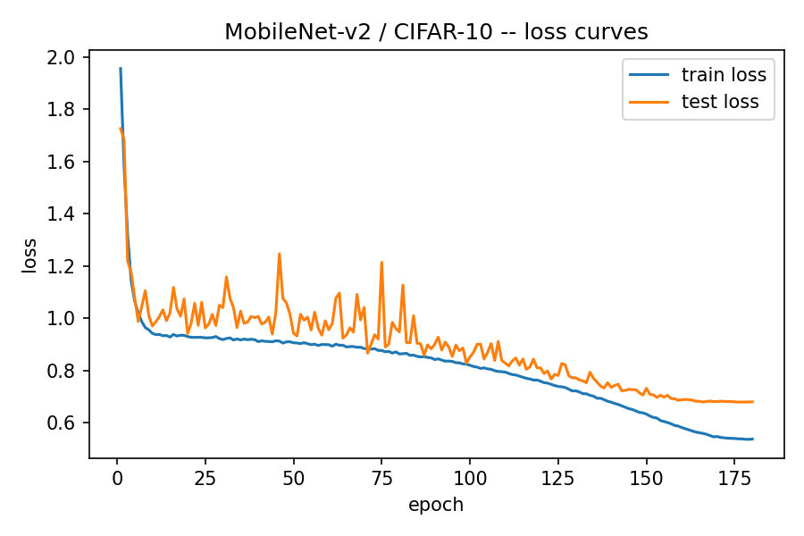
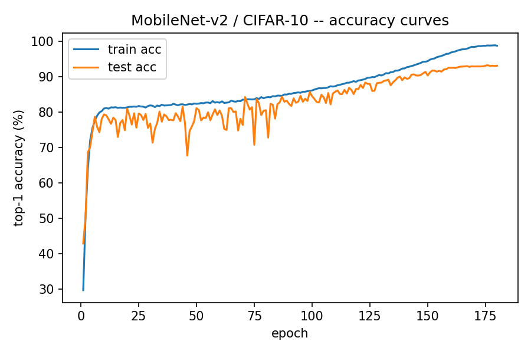

# Question 1. Training Baseline (20 points)

## (a) CIFAR-10 data preparation — normalization & augmentation (5 pts)

Code: [`src/data.py`](../src/data.py)

**Normalization.** Channel-wise mean/std computed over the full 50,000-image CIFAR-10
training split (values recomputed and printed by running the file directly):

- mean = `(0.4914, 0.4822, 0.4465)`
- std  = `(0.2470, 0.2435, 0.2616)`

These put every channel at approximately zero mean / unit variance, which keeps
BatchNorm statistics well conditioned during training.

**Transforms.**

| Split | Pipeline | Rationale |
|---|---|---|
| Train | `RandomCrop(32, padding=4, padding_mode='reflect')` | Gives the network translation invariance; reflect padding avoids the artificial black-border bias that zero-padding introduces at the crop boundary. |
| Train | `RandomHorizontalFlip(p=0.5)` | CIFAR-10 classes are left/right symmetric (a flipped cat is still a cat), so this is label-preserving. A vertical flip would not be (an upside-down truck looks wrong), so it is not used. |
| Train | `ToTensor()` → `Normalize(mean, std)` | Standard scaling into the network's expected input distribution. |
| Train (optional) | `RandomErasing(p=0.5, scale=(0.02, 0.15))` | Cutout-style occlusion regularization; exposed as a `--cutout-size` flag but left off (0) for the reported baseline run — see the failure-mode discussion in (c). |
| Test | `ToTensor()` → `Normalize(mean, std)` **only** | Deterministic — no random ops — so evaluation numbers are exactly reproducible run to run. |

**Reproducibility.** DataLoader shuffling uses a seeded `torch.Generator`, and each
worker process gets a distinct deterministic seed via `worker_init_fn`, so the
training data order is fixed for a given `--seed`.

```bash
python src/data.py     # prints the transform pipelines, recomputes the dataset
                        # stats above, and sanity-checks a batch
```

## (b) MobileNet-v2 configuration & training strategy (7 pts)

Code: [`src/model.py`](../src/model.py) (architecture), [`src/train.py`](../src/train.py) (training loop)

### Architecture

`src/model.py` reimplements the MobileNet-v2 inverted-residual architecture directly
(rather than importing `torchvision.models.mobilenet_v2`) so individual conv/BatchNorm
layers stay directly addressable for the Q2 compression pass.

CIFAR-10's 32×32 input is far smaller than ImageNet's 224×224. The stock MobileNet-v2
stride schedule downsamples by 32× total, which would collapse a 32×32 input to
below 1×1 before the classifier — so it cannot be used unmodified. Following the
standard CIFAR-MobileNet-v2 convention, two stride-2 layers are changed to stride 1:

- the stem, `Conv2d(3, 32, kernel=3, stride=1)` (ImageNet default: stride 2), and
- the first expansion stage `(t=6, c=24, n=2)`, stride 2 → 1.

All other inverted-residual stages keep their original ImageNet `(t, c, n, s)`
settings:

```
(1,  16, 1, 1)
(6,  24, 2, 1)   <- stride changed 2 -> 1 for CIFAR-10
(6,  32, 3, 2)
(6,  64, 4, 2)
(6,  96, 3, 1)
(6, 160, 3, 2)
(6, 320, 1, 1)
```

Net effect: total downsampling drops from 32× to 8×, so a 32×32 input reaches a
4×4×1280 feature map before global average pooling, instead of collapsing to ~1×1.

| Setting | Value |
|---|---|
| `width_mult` | 1.0 (no channel scaling) |
| `dropout` | 0.2 before the final linear classifier (torchvision's default) |
| BatchNorm | `eps=1e-5`, `momentum=0.1`, after every conv |
| Activation | ReLU6 throughout, matching the MobileNet-v2 paper |
| Total parameters | **2,236,682** |
| Pretraining | None — trained from scratch |

**Why train from scratch instead of using ImageNet-pretrained weights** (the
assignment explicitly allows either): transferring 224×224-pretrained weights to
32×32 CIFAR inputs would require either lossy upsampling of every image to 224×224
(expensive, and blurs the already-small objects) or the same stride surgery described
above, which invalidates most of the pretrained stem/early-block weights anyway. From
scratch training with the CIFAR-adapted stem is the standard, cheaper, more
appropriate choice at this resolution.

### Training strategy

| Setting | Value |
|---|---|
| Optimizer | SGD, momentum 0.9, Nesterov, weight_decay 5e-4 |
| LR schedule | 5-epoch linear warmup → cosine annealing to 0, base LR 0.1 |
| Batch size | 128 |
| Epochs | 180 |
| Regularization | weight decay + RandomCrop/RandomHorizontalFlip (part a) + label smoothing 0.1 |
| Seed | 42 (threaded through model init, data shuffling, and worker seeding) |

```bash
python src/train.py --epochs 180 --data-root ./data --output-dir ./runs/baseline
```

## (c) Final accuracy, curves, and failure modes (8 pts)

Trained on a single NVIDIA RTX A5000 GPU, ~16s/epoch, ~48 minutes total for 180 epochs.

**Final test top-1 accuracy: 93.18%** (best checkpoint, epoch 176 of 180).
Final-epoch (180) accuracy: 98.70% train / 93.04% test.

Per-class accuracy (best checkpoint):

| Class | Acc | Class | Acc |
|---|---|---|---|
| airplane | 93.9% | deer | 93.5% |
| automobile | 96.7% | dog | **89.8%** |
| bird | 91.3% | frog | 95.2% |
| cat | **85.6%** | horse | 94.5% |
| | | ship | 95.1% |
| | | truck | 96.2% |

**Loss curves:**



**Accuracy curves:**



### Failure modes

- **Class confusion.** The two weakest classes are cat (85.6%) and dog (89.8%) — the
  most visually similar pair in CIFAR-10 (similar fur texture, pose variety, and
  color distribution at 32×32 resolution). This cat/dog/bird confusion cluster is the
  standard failure mode reported for CIFAR-10 classifiers in general, not something
  specific to this architecture or training run.
- **Mid-training test-accuracy noise.** The test-accuracy curve is visibly noisy
  through the constant-high-LR middle epochs (roughly epochs 45–80), including a few
  sharp dips — an expected consequence of SGD at LR 0.1 with no LR decay yet applied.
  It smooths out and converges cleanly once the cosine schedule brings the LR near
  zero in the final ~30 epochs.
- **Mild overfitting.** Final train accuracy (98.7%) versus test accuracy (93.0%)
  leaves a ~5.7-point gap. This is expected, not a pipeline defect: a 2.2M-parameter
  model trained for 180 epochs on only 50k images with relatively light augmentation
  (crop + flip only; `--cutout-size 0` for this run, though the flag exists) will
  memorize some training-set-specific detail. A longer schedule with `RandomErasing`
  enabled (`--cutout-size > 0`) would likely narrow this gap further.

Reproduce all of the above:
```bash
python src/train.py --epochs 180 --data-root ./data --output-dir ./runs/baseline
python src/evaluate.py --checkpoint runs/baseline/best.pt --data-root ./data
python src/plot_curves.py --history runs/baseline/history.csv
```
